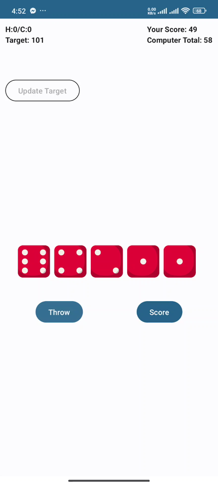
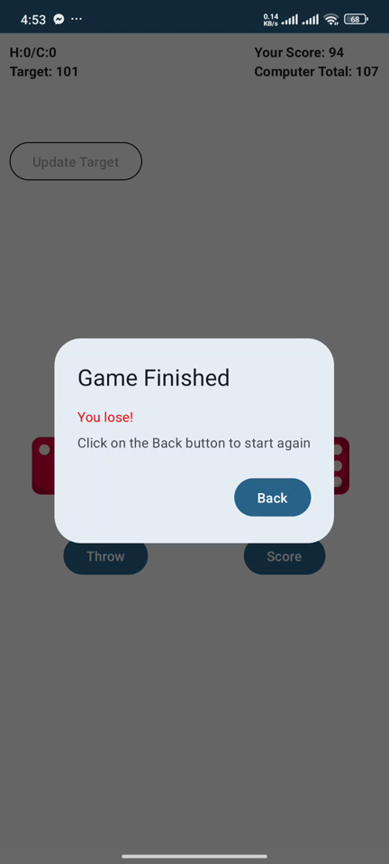
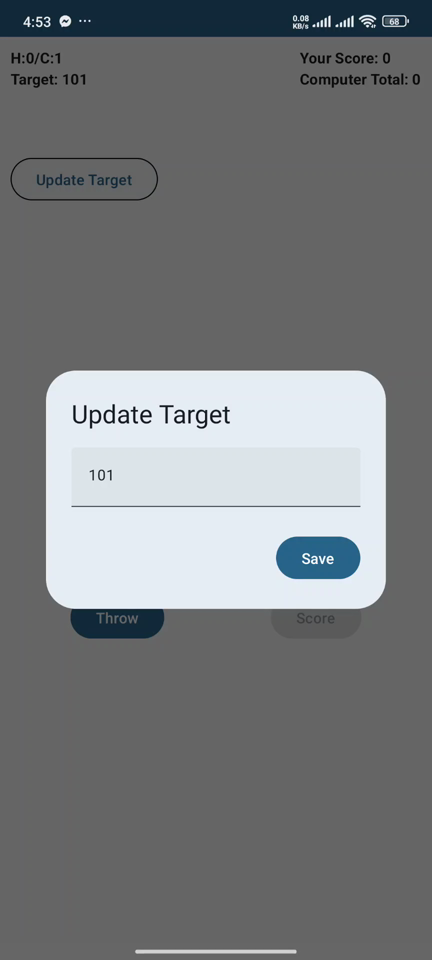
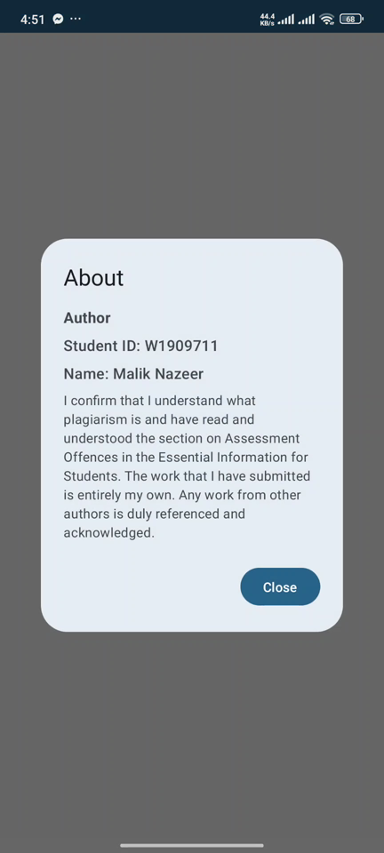

# 🎲 Dice Game: Human vs Computer (Android)

An Android game where **you race the computer to a target score by rolling five dice**. You can re-roll each turn to chase a better score, while the computer opponent decides automatically when to re-roll and when to keep its score.


-3DDC84?logo=android&logoColor=white)


<p align="center">
  
  
  
</p>

---

## At a glance (for recruiters)

| | |
|---|---|
| **What it is** | A turn-based mobile dice game played against a computer opponent |
| **Platform** | Android phones (Android 8.0 and newer) |
| **Language / UI** | Kotlin with Jetpack Compose (Google's modern Android UI toolkit) and Material 3 design |
| **Skills shown** | Declarative UI, state management that survives screen rotation, screen navigation, a rule-based computer opponent, coroutine-driven game loop, dialogs and user input |
| **Try it** | Install [`app-debug.apk`](Dice%20Game/app-debug.apk) on an Android device, or watch the [demo video](Dice%20Game/Dice_Game-2025-02-18-16-51-42-412.mp4) |

---

## How the game works

1. Tap **New Game**. Each turn you throw **5 dice**.
2. After a throw you can **Score** to keep the total, or **Throw** again. You get up to **3 throws per turn**, and the last throw is scored automatically.
3. Then the **computer takes its turn**, deciding by itself whether to re-roll or keep its score.
4. The first player to reach the **target score (101 by default)** wins. If both players pass the target with the same score, the game goes into **tie-break rounds** with one throw each.
5. A **win counter** (`H:x / C:y`) tracks human and computer victories across games.

## Features

- **Five animated dice** shown with custom dice images.
- **Computer opponent with a simple strategy.** It keeps its score as soon as it has reached the target, has run out of throws, or is ahead of you. Otherwise it keeps rolling.
- **Adjustable target.** Before the first throw, tap **Update Target** to set your own winning score.
- **Tie-break handling** when both players finish level.
- **Game-over dialog** that announces the winner, plus a running win/loss tally.
- **State survives rotation.** All game state uses `rememberSaveable`, so turning the phone doesn't reset the game.
- **About screen** with author details.

## Screenshots

| Home screen | Playing a turn | Game finished |
|:---:|:---:|:---:|
|  |  |  |
| **New Game** or **About** | Five dice, running scores for you and the computer, and Throw / Score buttons | The winner is announced and the win tally updates |

| Setting a custom target | About dialog |
|:---:|:---:|
|  |  |
| Change the winning score before the game starts | Author information |

## Tech stack

| Area | Technology |
|---|---|
| Language | Kotlin |
| UI | Jetpack Compose, Material 3 |
| Navigation | Navigation-Compose (Home → Game) |
| State | Compose state + `rememberSaveable`, shared `ViewModel` for the win tally |
| Concurrency | Kotlin coroutines (`LaunchedEffect`) run the computer's turns |
| Build | Gradle, compileSdk 33, minSdk 26 |

## Getting started

### Requirements
- [Android Studio](https://developer.android.com/studio) (Flamingo or newer recommended)
- An Android device or emulator running Android 8.0 (API 26) or higher

### Run the project
1. Clone the repository:
   ```bash
   git clone https://github.com/MalikNazeer1/Dice-Game.git
   ```
2. In Android Studio choose **File → Open**, then select `Dice Game/MyDiceGame`.
3. Let Gradle sync, then press **Run ▶**.

### Install the ready-made APK
Copy `Dice Game/app-debug.apk` to an Android phone and open it. You may need to allow *Install unknown apps* first.

## Project structure

```
Dice Game/
├── app-debug.apk                       # Pre-built installable app
├── Dice_Game-...mp4                    # Gameplay demo video
└── MyDiceGame/                         # Android Studio project
    └── app/src/main/java/com/maliknazeer/mydicegame/
        ├── MainActivity.kt             # App entry point
        ├── Navigation.kt               # Home ↔ Game navigation
        ├── data/model/ComputerDecision.kt
        ├── ui/screens/homescreen/      # Home screen and About dialog
        ├── ui/screens/gamescreen/      # Game board, turns, dialogs, win check
        ├── ui/screens/SharedViewModel.kt  # Win tally
        ├── ui/theme/                   # Colours, typography, theme
        └── utils/Utils.kt              # Dice rolling and computer strategy
```
